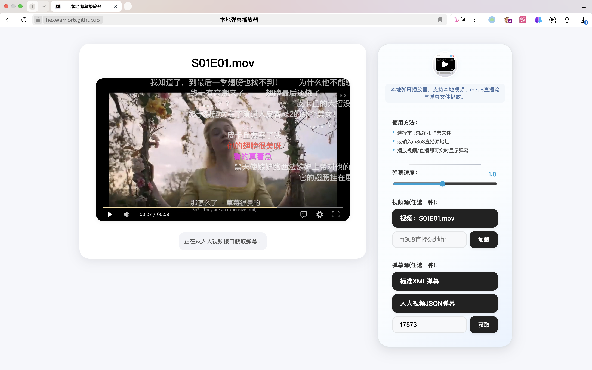

# 本地弹幕播放器

本项目是一个极简风格的本地弹幕播放器，支持本地视频文件与多种格式弹幕文件的加载与播放。用户可以在本地浏览器中体验弹幕视频的乐趣，无需上传文件，保护隐私，操作便捷。

## 功能特色

- 支持本地 MP4 视频文件播放。
- 支持本地弹幕文件加载：
    - 标准 XML 格式（如 B 站导出弹幕）。
    - 人人视频 JSON 格式。
- 支持通过 人人视频弹幕 ID 在线获取弹幕。
- 支持弹幕速度调节（0.1x - 2.0x）。
- 使用 Web Worker 异步解析 XML 弹幕，提高大文件加载性能。
- 弹幕根据视频播放时间实时加载，优化观看体验。
- 实时发送弹幕，体验与主流弹幕网站一致。
- 响应式布局，适配桌面端与移动端。
- 极简美观的 UI 设计。

## 使用方法

1.  打开本项目的 `index.html` 文件（建议使用现代浏览器，如 Chrome、Edge、Safari）。
    > 也可以直接访问：[https://hexwarrior6.github.io/DanMuWebPlayer/](https://hexwarrior6.github.io/DanMuWebPlayer/)
2.  在右侧“上传视频”区域，点击“选择本地视频文件”按钮选择本地 MP4 视频文件。
3.  在右侧“上传弹幕（任选一种）”区域，选择一种方式加载弹幕：
    *   **标准XML弹幕**：点击按钮选择本地 XML 弹幕文件。
    *   **人人视频JSON弹幕**：点击按钮选择本地 JSON 弹幕文件。
    *   **通过ID获取**：在输入框中输入人人视频剧集弹幕 ID，点击“获取”按钮。
4.  视频加载后会自动初始化播放器。
5.  点击播放按钮开始播放视频，弹幕会随视频实时显示。
6.  可以通过“弹幕速度”滑块实时调整弹幕的滚动速度。
7.  可在播放器下方的输入框输入弹幕内容并点击“发送”按钮，弹幕会实时显示在视频上方。

## 技术栈

- [DPlayer](https://github.com/DIYgod/DPlayer)：弹幕视频播放器
- 原生 JavaScript (ES6+)
- HTML5 + CSS3
- Web Workers

## 兼容性

- 支持主流现代浏览器（Chrome、Edge、Safari、Firefox）
- 支持桌面端与移动端自适应

## 项目结构
/index.html         主页面及核心逻辑
/favicon.png        网站图标
/README.md          项目说明文档
/screenshot.png     项目截图

## 注意事项

- 本项目所有操作均在本地浏览器完成，不会上传任何文件到服务器，安全可靠。
- 支持的弹幕格式包括标准 XML（如 B 站导出）和人人视频 JSON。
- 通过 ID 获取弹幕功能依赖人人视频的公开接口，接口可用性无法保证。
- 若遇到弹幕加载缓慢或解析失败，请检查文件格式是否正确或尝试更换浏览器。

## 致谢

- 感谢 [DPlayer](https://github.com/DIYgod/DPlayer) 提供优秀的弹幕播放器组件。

---

欢迎反馈建议与问题！